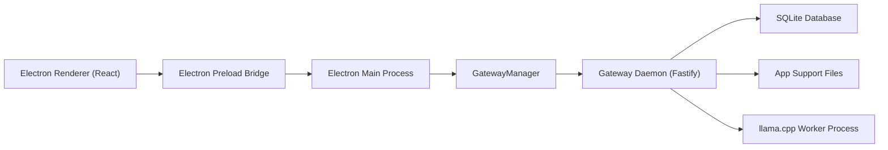

# LM Hub Design, Deployment, and User Guide

This document is the operator and user-facing guide for the current LM Hub workspace. It describes the system as it exists in this repository today, including the architecture, deployment paths, operational controls, and desktop user workflows.

## Scope

LM Hub currently ships these core capabilities:

- An Electron desktop shell with a React renderer.
- A separately runnable Node.js gateway daemon.
- OpenAI-compatible public endpoints for model listing, chat completions, and embeddings.
- A loopback-only control plane for model registration, lifecycle management, downloads, chat persistence, and observability.
- SQLite-backed persistence for models, chat history, downloads, engine versions, prompt caches, and API logs.
- `llama.cpp`-based model management, including local GGUF registration, preload and evict controls, provider-backed downloads, and repair-oriented groundwork.

This guide intentionally distinguishes between:

- implemented behavior in this repo
- release automation and packaging behavior
- planned but not yet fully wired features

## 1. Design Overview

### 1.1 Product model

The repository is built around a strict separation of concerns:

- The desktop app owns local UX, tray behavior, secure IPC, and gateway process management.
- The gateway owns API serving, worker supervision, persistence, downloads, telemetry, and runtime policy.
- Engine and model packages own `llama.cpp` command planning, GGUF inspection, artifact integrity, and download/model lifecycle helpers.
- Shared packages define contracts, filesystem layout, config loading, and reusable persistence boundaries.

### 1.2 Runtime topology



### 1.3 Workspace layout

- `apps/desktop`: Electron main process, preload bridge, React renderer, and desktop UI.
- `services/gateway`: Fastify public and control servers, runtime supervisor, telemetry, and request execution.
- `packages/shared-contracts`: Zod schemas and shared domain types.
- `packages/platform`: app-support path resolution, config loaders, discovery file handling, and security helpers.
- `packages/db`: SQLite migrations, repositories, retention helpers, and migration-safety tools.
- `packages/engine-core`: stable engine adapter contracts.
- `packages/engine-llama`: `llama.cpp` model manager, GGUF inspection, download manager, and worker harness.
- `packages/ui`: shared UI tokens and shell metadata.

### 1.4 Process responsibilities

#### Desktop main process

The Electron main process is responsible for:

- enforcing a single app instance
- creating the window and tray integration
- starting and stopping the gateway through `GatewayManager`
- relaying telemetry and shell state to the renderer
- exposing a constrained preload bridge instead of giving the renderer Node access

#### Gateway daemon

The gateway is a standalone Node.js process with two listeners:

- a public listener for `/v1/*`
- a control listener for `/control/*`, `/config/*`, and WebSocket events

The gateway is responsible for:

- validating and serving API requests
- supervising model workers
- admitting or rejecting work based on runtime state and resource policy
- tracking API logs and request traces
- managing downloads, model registration, prompt caches, and engine metadata
- persisting operational state in SQLite

#### Worker processes

Each loaded runtime is isolated behind a worker harness. The current production-oriented path is `llama.cpp`, keyed by a runtime identity of:

- model id
- engine type
- runtime role
- config hash

This lets the gateway treat differently configured copies of the same base model as distinct runtime targets.

### 1.5 Request and event flow

A typical model request path is:

1. A desktop action or external client calls the public or control API.
2. The gateway resolves the model and its stored profile.
3. The runtime supervisor checks worker state, backoff state, circuit-breaker state, and memory budget.
4. If a worker is not already warm, the gateway launches it through the `llama.cpp` harness and waits for readiness.
5. The request is proxied or normalized through the adapter layer.
6. Request traces, API logs, and state events are published back to the desktop shell.

Telemetry moves through a shared event envelope:

- `MODEL_STATE_CHANGED`
- `LOG_STREAM`
- `METRICS_TICK`
- `REQUEST_TRACE`

### 1.6 Persistence model

The gateway owns a single SQLite database connection and runs migrations from `packages/db/migrations`.

Structured state includes:

- model artifacts and model profiles
- engine versions
- prompt caches
- download tasks
- chat sessions and messages
- API logs
- migration metadata

Migration safety is built around:

- a printed migration plan
- forward-only numbered migrations
- a WAL-safe backup path using SQLite `VACUUM INTO`

### 1.7 Filesystem layout

The app-support root is resolved by environment:

- development: `<repo>/.local/lm-hub/dev`
- test: `<repo>/.local/lm-hub/test`
- packaged macOS: `~/Library/Application Support/LM Hub`
- packaged Windows: `%APPDATA%/LM Hub`
- packaged Linux: `~/.config/lm-hub`

Legacy `local-llm-hub` folders migrate automatically to the new paths on first launch.

Under that root, the platform package creates:

- `config/`
- `logs/`
- `runtime/`
- `data/`
- `downloads/`
- `engines/`
- `models/`
- `checksums/`
- `prompt-caches/`
- `tmp/`

Important files:

- `config/gateway.json`
- `config/desktop.json`
- `runtime/gateway-discovery.json`
- `data/gateway.sqlite`

### 1.8 Security model

Security defaults are intentionally conservative:

- the public listener defaults to `127.0.0.1:1337` and can be changed in `config/gateway.json` or the desktop Settings screen
- the control listener defaults to `127.0.0.1:16384`
- control routes are loopback-only even when LAN is enabled for the public API
- bearer auth can be enabled for public and control traffic
- startup fails closed if auth is required but no public token resolves
- CORS is allowlist-based

Configuration precedence is fixed:

1. package defaults
2. JSON config file values
3. environment overrides

See also:

- [config-precedence.md](./config-precedence.md)
- [package-ownership.md](./package-ownership.md)

## 2. Current API Surface

### 2.1 Public API

The gateway currently implements these public routes:

- `GET /healthz`
- `GET /v1/models`
- `POST /v1/chat/completions`
- `POST /v1/embeddings`

Notes:

- Chat completions support non-streaming and SSE streaming modes.
- Tool calls are passed through as OpenAI-style response payloads; the gateway does not execute tools itself.
- Embeddings routing is supported through the runtime abstraction.

### 2.2 Control API

The control listener currently implements:

- `GET /healthz`
- `GET /control/health`
- `GET /control/models`
- `POST /control/models/register-local`
- `POST /control/models/preload`
- `POST /control/models/evict`
- `PUT /config/models/:id`
- `GET /control/chat/sessions`
- `GET /control/chat/messages`
- `POST /control/chat/sessions`
- `POST /control/chat/run`
- `GET /control/observability/api-logs`
- `GET /control/downloads`
- `POST /control/downloads`
- `GET /control/engines`
- `POST /control/engines`
- `POST /control/system/shutdown`
- `GET /control/events` over WebSocket

Important caveat:

- `POST /control/engines` is still a placeholder control route. It acknowledges the request but does not yet perform real engine management mutations end-to-end.

## 3. Deployment Guide

### 3.1 Prerequisites

For local development and build/test work:

- Node.js 22+
- pnpm 10.32.1
- macOS if you want to build the desktop `.app` bundle

For signed macOS release work:

- Xcode command line tools
- `codesign`
- `xcrun notarytool`
- `xcrun stapler`
- `spctl`
- Apple signing credentials

### 3.2 Developer quick start

Install dependencies:

```bash
pnpm install
```

Start the full desktop development workflow:

```bash
pnpm dev
```

This launches:

- watch builds for shared contracts, platform, UI, and gateway
- watch builds for Electron main and preload output
- the Vite renderer dev server
- Electron pointed at the local renderer server

Useful verification commands:

```bash
pnpm lint
pnpm typecheck
pnpm test
pnpm build
pnpm validate
```

### 3.3 Gateway-only deployment from a workspace checkout

Build the workspace:

```bash
pnpm build
```

Run only the gateway:

```bash
pnpm --filter @localhub/gateway start
```

For a production-like support path while running outside the packaged desktop, set:

```bash
export LOCAL_LLM_HUB_ENV=packaged
```

You can also override the support root directly:

```bash
export LOCAL_LLM_HUB_APP_SUPPORT_DIR=/absolute/path/to/localhub-support
```

### 3.4 Configuration

#### Config files

The platform package reads:

- gateway config from `config/gateway.json`
- desktop config from `config/desktop.json`

You can override those paths with:

- `LOCAL_LLM_HUB_GATEWAY_CONFIG_FILE`
- `LOCAL_LLM_HUB_DESKTOP_CONFIG_FILE`

#### Gateway environment variables

Shared gateway config:

- `LOCAL_LLM_HUB_ENV`
- `LOCAL_LLM_HUB_GATEWAY_PUBLIC_HOST`
- `LOCAL_LLM_HUB_GATEWAY_PUBLIC_PORT`
- `LOCAL_LLM_HUB_GATEWAY_CONTROL_HOST`
- `LOCAL_LLM_HUB_GATEWAY_CONTROL_PORT`
- `LOCAL_LLM_HUB_ENABLE_LAN`
- `LOCAL_LLM_HUB_AUTH_REQUIRED`
- `LOCAL_LLM_HUB_LOG_LEVEL`
- `LOCAL_LLM_HUB_DEFAULT_MODEL_TTL_MS`
- `LOCAL_LLM_HUB_REQUEST_TRACE_RETENTION_DAYS`

Gateway auth and telemetry overrides:

- `LOCAL_LLM_HUB_AUTH_TOKEN`
- `LOCAL_LLM_HUB_GATEWAY_PUBLIC_BEARER_TOKEN`
- `LOCAL_LLM_HUB_GATEWAY_CONTROL_BEARER_TOKEN`
- `GATEWAY_PUBLIC_BEARER_TOKEN`
- `GATEWAY_CONTROL_BEARER_TOKEN`
- `LOCAL_LLM_HUB_GATEWAY_TELEMETRY_INTERVAL_MS`
- `GATEWAY_TELEMETRY_INTERVAL_MS`

#### Desktop environment variables

- `LOCAL_LLM_HUB_ENV`
- `LOCAL_LLM_HUB_CLOSE_TO_TRAY`
- `LOCAL_LLM_HUB_AUTO_LAUNCH_GATEWAY`
- `LOCAL_LLM_HUB_THEME`
- `LOCAL_LLM_HUB_DESKTOP_WIDTH`
- `LOCAL_LLM_HUB_DESKTOP_HEIGHT`
- `LOCAL_LLM_HUB_LOG_LEVEL`

#### Example secure local configuration

```bash
export LOCAL_LLM_HUB_AUTH_REQUIRED=true
export LOCAL_LLM_HUB_AUTH_TOKEN=replace-me-with-a-long-random-token
export LOCAL_LLM_HUB_GATEWAY_PUBLIC_PORT=11434
export LOCAL_LLM_HUB_GATEWAY_CONTROL_PORT=11435
```

If you want LAN access for the public API:

```bash
export LOCAL_LLM_HUB_ENABLE_LAN=true
export LOCAL_LLM_HUB_GATEWAY_PUBLIC_HOST=0.0.0.0
```

Recommended practice:

- always pair LAN exposure with bearer auth
- keep the control listener loopback-only
- restrict CORS to known origins or hosts

### 3.5 Database migrations and backup

Print the migration plan for an existing database:

```bash
pnpm db:migrate:plan /absolute/path/to/gateway.sqlite
```

Create a backup and apply pending migrations:

```bash
pnpm db:migrate --backup /absolute/path/to/gateway.sqlite
```

Important behavior:

- the plan shows current version, target version, and pending migrations
- `--backup` now creates a WAL-safe SQLite backup before migration work is applied

### 3.6 Packaging and release

#### Build the desktop bundle

```bash
pnpm build
pnpm package:desktop:macos
```

The packaging script builds a macOS `.app` under `release/macos/` and stages:

- desktop renderer assets
- Electron main and preload output
- the gateway build output
- workspace package runtime dependencies
- the pnpm store entries needed by preserved symlinks

If packaging fails with a missing Electron template, run:

```bash
pnpm install
```

and confirm `apps/desktop/node_modules/electron/dist/Electron.app` exists.

#### Sign and notarize locally

Required environment variables:

- `APPLE_SIGNING_IDENTITY`
- `APPLE_ID`
- `APPLE_APP_SPECIFIC_PASSWORD`
- `APPLE_TEAM_ID`

Then run:

```bash
pnpm notarize:desktop:macos
```

The notarization script performs:

1. deep codesigning with hardened runtime
2. `codesign --verify`
3. zip archive creation with `ditto`
4. `xcrun notarytool submit --wait`
5. `xcrun stapler staple`
6. `spctl --assess`

#### CI release workflow

The GitHub workflow at [release-desktop.yml](./release-desktop.yml) performs:

1. checkout
2. dependency install
3. workspace validation
4. bundle packaging
5. signing, notarization, stapling, and verification
6. artifact upload from `release/macos/`

### 3.7 Operations and troubleshooting

Use these areas when debugging a live system:

- Desktop Settings screen for support paths and runtime state.
- `runtime/gateway-discovery.json` for resolved public/control addresses.
- `data/gateway.sqlite` for persisted model, chat, download, engine, and log state.
- the Dashboard screen for request traces, API performance, and recent log events.
- `GET /control/health` for control-plane health.
- `GET /healthz` on both listeners for liveness.

If the desktop shell looks unhealthy:

1. Open Settings.
2. Review the current control URL and support paths.
3. Use `Restart gateway` for recovery.
4. Use `Shutdown gateway` for a full stop.

If the gateway refuses new work during shutdown:

- this is expected while graceful drain is in progress
- restart now waits for the old process to exit before booting a replacement

## 4. User Guide

### 4.1 First run

The desktop shell opens into a multi-screen workflow:

- Overview
- Model Library
- Downloads
- Chat Sandbox
- Settings

Recommended first-run flow:

1. Import a local model or search and queue a downloadable artifact.
2. Register the model in the Model Library.
3. Preload it before heavy use.
4. Start chatting in the Chat Sandbox.
5. Review security posture in Settings before enabling LAN access.

### 4.2 Overview screen

The Overview screen focuses on observability:

- gateway phase and current shell status
- active worker count
- resident and GPU memory metrics when available
- latest request trace
- recent API performance
- recent gateway log events

Use this page when you want a quick answer to:

- Is the gateway healthy?
- Are workers loaded?
- Are requests completing?
- What is the latest TTFT or token rate?

### 4.3 Model Library

The Model Library is the operational center for local models.

You can:

- import a local GGUF file through the desktop file picker
- register a model with an optional alias name
- inspect metadata such as architecture, quantization, context length, and engine version
- preload a model into memory
- evict a loaded model
- save advanced per-model settings while the model is not loaded
- rename a loaded model with a live alias update

Advanced saved settings currently include:

- alias name
- pinned state
- default TTL
- context length override
- GPU layer override

Guidance:

- preload before benchmarking or external API use if you want to avoid cold-start latency
- evict models you no longer need to release memory
- save advanced settings before preload, because loaded models do not accept profile edits from the screen

### 4.4 Downloads

The Downloads screen handles provider-backed discovery and transfer tracking.

You can:

- search remote provider catalogs
- inspect basic artifact metadata
- queue a download
- pause or resume supported tasks
- monitor progress until completion

Current workflow after download:

1. Search and queue the artifact.
2. Wait for it to complete.
3. Register the downloaded artifact from the Model Library.

### 4.5 Chat Sandbox

The Chat Sandbox provides built-in local chat with persistent sessions.

You can:

- create a new session
- pick the active model
- save a system prompt
- send prompts through the control API
- browse historical sessions
- revisit stored messages

Behavior notes:

- sessions and messages are stored in SQLite
- the assistant response is animated in the UI for readability, even though the stored completion is persisted as a single response object
- session configuration is saved independently of message sending

### 4.6 Settings

The Settings screen is the best place for operators and power users to understand the live runtime.

It shows:

- onboarding guidance
- security posture for LAN and auth state
- explicit runtime controls
- support and config file paths
- desktop behavior settings

Current recovery controls:

- `Restart gateway`
- `Shutdown gateway`

Security guidance shown by the app:

- loopback-only access is the default safe posture
- LAN exposure without bearer auth should be treated as unsafe
- the screen is diagnostic today and does not yet directly edit LAN/auth settings in place

### 4.7 Background behavior and tray model

Closing the main window does not necessarily stop the daemon. The current behavior is:

- closing the window hides the desktop shell
- the tray remains available
- the gateway may continue running in the background
- explicit shutdown is available from Settings or by calling the control shutdown route

### 4.8 External API use

If the public API is running on the default port and auth is enabled, list models with:

```bash
curl http://127.0.0.1:1337/v1/models \
  -H "Authorization: Bearer $LOCAL_LLM_HUB_AUTH_TOKEN"
```

Run a chat completion:

```bash
curl http://127.0.0.1:1337/v1/chat/completions \
  -H "Authorization: Bearer $LOCAL_LLM_HUB_AUTH_TOKEN" \
  -H "Content-Type: application/json" \
  -d '{
    "model": "your-model-id",
    "messages": [
      { "role": "user", "content": "Hello from LM Hub" }
    ]
  }'
```

Run embeddings:

```bash
curl http://127.0.0.1:1337/v1/embeddings \
  -H "Authorization: Bearer $LOCAL_LLM_HUB_AUTH_TOKEN" \
  -H "Content-Type: application/json" \
  -d '{
    "model": "your-embedding-model-id",
    "input": "vectorize this text"
  }'
```

If public auth is disabled, omit the `Authorization` header.

Clients that prefer API-key style headers can also send the same token as
`x-api-key` or `api-key` on either plane.

The public model list uses the visible alias as `id` and `name`, while the
underlying artifact identifier stays available as `model_id`.

In the desktop Settings screen, you can choose the header name and paste the
token value the desktop uses for its own gateway requests.

## 5. Known Gaps and Current Limitations

The current repo is strong on runtime foundations, but a few areas remain intentionally incomplete:

- `POST /control/engines` is still a stub and does not yet expose full engine activation or repair flows.
- The Settings screen surfaces security posture but does not yet give direct in-screen remediation actions for LAN and auth changes.
- The proposal mentions audio, speech, rerank, and richer multimodal routes, but the current public API only ships `/v1/models`, `/v1/chat/completions`, and `/v1/embeddings`.
- Full signed-release validation requires a macOS machine with an installed Electron runtime template and Apple signing credentials.

## 6. Related References

- [README.md](../README.md)
- [release-readiness.md](./release-readiness.md)
- [config-precedence.md](./config-precedence.md)
- [package-ownership.md](./package-ownership.md)
- [thread-3-stage-0-contracts.md](./thread-3-stage-0-contracts.md)
